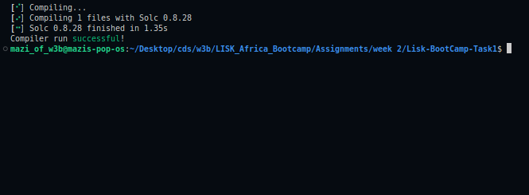
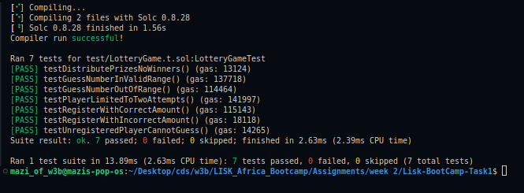
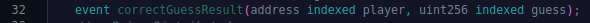
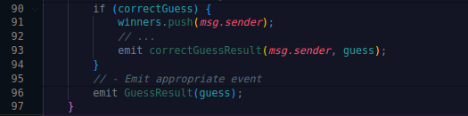

# Solidity Smart Contract Assignment: LotteryGame

> ## Compiling
>
> ```bash
> ~$ forge build
> ```
>
> 
> <br>
> Compilation Success

<br>
<br>

> ## Component Testing
>
> ```bash
> ~$ forge test
> ```
>
> 
> <br>
> 100% Test Score

<br>
<br>

> ## I also added a custom event to indicate when a user makes a correct guess
>
> 
> 

<br>
<br>

> Deploying
>
> ```bash
>    clear ; source .env ; forge create --rpc-url $RPC_URL --private-key $PRIVATE_KEY src/LotteryGame.sol:LotteryGame --broadcast
> ```
>
> Address: 0x750C9349D2300032913af321d9EA309025A43FF5

<br>
<br>

> Verifying
>
> ```bash
>    forge verify-contract   --rpc-url https://rpc.sepolia-api.lisk.com   --verifier blockscout   --verifier-url 'https://sepolia-blockscout.lisk.com/api/'   0x750C9349D2300032913af321d9EA309025A43FF5   src/LotteryGame.sol:LotteryGame
> ```
>
> [Verified contract address](https://sepolia-blockscout.lisk.com/address/0x750c9349d2300032913af321d9ea309025a43ff5)
